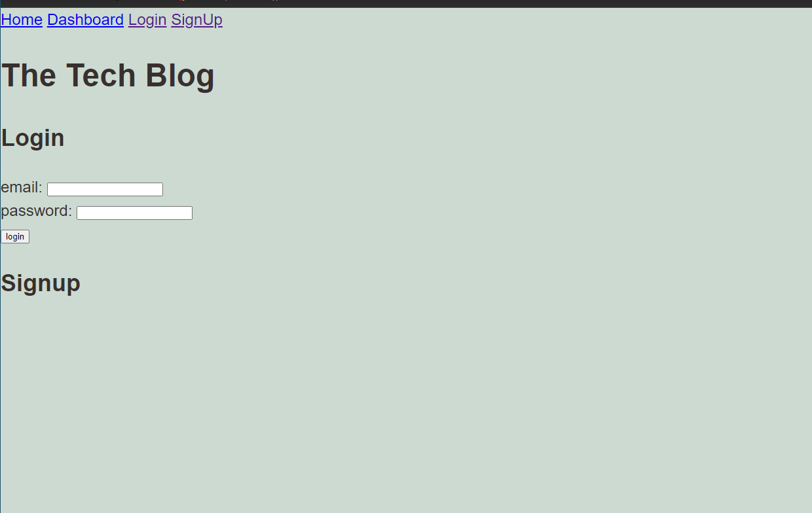

# THE Tech Blog

  

  ## Description
  THE Tech Blog is a web app where developers can go and publish blog post amongst their peers. You are also able to comment on other developers posts. This app follows the MVC architectural structure. Unfortunatley I just have yet to finsish building this application. More to come! 

  ## Table of Contents
  1. [Installation](#installation)
  2. [Usage](#usage)
  3. [License](#license)
  4. [Contributing](#contributing)
  5. [Tests](#tests)
  6. [Questions](#questions)

  ## Installation
  To install the necessary dependencies, run the following command:
  - npm install dependencies already on package.json
  - node seeds/seed.js
  - npm start server

  ## Usage
  Once first prompted on the website you will be able to view blogs from other developers. To be able to participate you will need to sign up and create a username and password.

  ## License 
  This project is licensed under the MIT license.

  ## Contributing
  Myself

  ## Tests
  To run tests, run the following command:
  no testing at this time
  
  ## Questions
  If you have any questions about this repo, open an issue or contact me directly at [DomSpadafora@gmail.com](mailto:DomSpadafora@gmail.com).
  You can find more of my work at [DomSpadafora](https://www.github.com/DomSpadafora).

